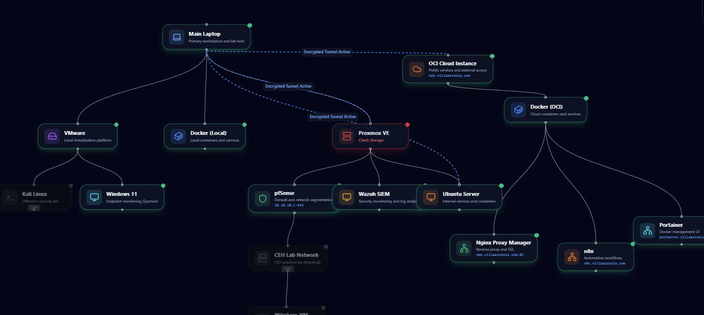

# 🏗️ Homelab Infrastructure Portfolio

Interactive visualization and documentation of homelab network topology with AI-powered chat assistant.




## ✨ Features

- 🎨 **Interactive Diagram**: React Flow-based topology visualization with drag, zoom, and pan
- 💬 **AI Chat Assistant**: Context-aware LLM integration with infrastructure knowledge
- 📝 **Rich Documentation**: Markdown-formatted docs with syntax highlighting for each node
- ✏️ **Live Editor**: Admin mode for adding/editing nodes and connections in real-time
- 🎭 **Multiple Views**: Filter by layer (physical/virtual/cloud) or infrastructure type
- 🔒 **Security Guardrails**: Anti-jailbreak protection to keep chat focused on infrastructure
- ⚡ **Token Optimization**: Smart context selection reduces LLM API costs by 90%
- 📱 **Responsive Design**: Works on desktop, tablet, and mobile devices
- 🎨 **Dark Mode**: Beautiful gradient UI with glassmorphism effects

## 🚀 Quick Start

### Prerequisites

- Node.js 20+ and npm
- LiteLLM server (or OpenRouter/OpenAI API key)

### Installation

```bash
# Clone repository
git clone https://github.com/VillaArreola/homelab-portfolio.git
cd homelab-portfolio

# Install dependencies
npm install

# Configure environment
cp .env.example .env.local
# Edit .env.local with your LLM credentials

# Run development server
npm run dev
```

Open [http://localhost:3000](http://localhost:3000) to view the app.

## ⚙️ Configuration

### Environment Variables

Create `.env.local` with these variables:

```bash
# LLM Configuration (required for chat feature)
LLM_API_URL=https://your-litellm-server.com/v1/chat/completions
LLM_API_KEY=your-api-key
LLM_MODEL=qwen3-vl:Cloud
LLM_TEMPERATURE=0.7
LLM_MAX_TOKENS=500

# Admin Configuration (required for node editor)
NEXT_PUBLIC_ADMIN_PASSWORD=your-secure-password
```

For detailed LLM setup instructions, see [LLM_CONFIG.md](LLM_CONFIG.md).

### Supported LLM Providers

- **LiteLLM** (recommended) - Universal proxy for multiple providers
- **OpenRouter** - Easy setup with many models
- **OpenAI** - Direct API integration
- **Local Models** - Via LiteLLM with Ollama/LM Studio

```bash
# Build for production
npm run build

# Start production server
npm start
```

## 🎯 Usage

### Viewing Infrastructure

- **Navigate**: Use top navigation to switch between views (Architecture, Security, etc.)
- **Search**: Type node names in the toolbar search
- **Filter**: Click layer filters (Physical/Virtual/Cloud) to focus
- **Zoom**: Scroll to zoom, drag to pan, or use MiniMap for navigation
- **Details**: Click any node to see detailed documentation

### AI Chat Assistant

- **Open**: Click the chat icon (bottom-left) to open the assistant
- **Ask**: Questions about your infrastructure (IPs, VLANs, services, etc.)
- **Examples**:
  - "¿Qué VLANs están configuradas?"
  - "Lista todos los servicios activos"
  - "¿Cuál es la IP de Proxmox?"
  - "Muéstrame la topología completa"

The chat uses optimized context to minimize token usage while maintaining accuracy.

### Editing Infrastructure (Admin)

1. Click Admin icon (top-right)
2. Enter password (from `NEXT_PUBLIC_ADMIN_PASSWORD`)
3. Edit node properties in the modal
4. Click "Save Changes" to persist

Changes are saved to `src/data/infrastructure.json`.

## 🏗️ Project Structure

```
homelab-portfolio/
├── src/
│   ├── app/
│   │   ├── api/
│   │   │   ├── chat/              # LLM proxy API route
│   │   │   └── save-infrastructure/ # Node editor save endpoint
│   │   ├── components/
│   │   │   ├── chat/              # AI chat interface
│   │   │   ├── diagram/           # React Flow components
│   │   │   ├── layout/            # Header, Toolbar
│   │   │   └── modals/            # Admin, node editor modals
│   │   └── page.tsx               # Main app entry
│   ├── data/
│   │   ├── infrastructure.json    # Topology data
│   │   ├── connections.json       # Node relationships
│   │   └── views.json             # View configurations
│   └── lib/
│       ├── chatHelpers.ts         # LLM context optimization
│       ├── infraTypes.ts          # TypeScript types
│       └── treeToFlow.ts          # Data transformation
├── public/                        # Static assets
├── .env.local                     # Local environment (gitignored)
├── .env.example                   # Environment template
└── LLM_CONFIG.md                  # Detailed LLM setup guide
```

## 🔒 Security

- **API Keys Protected**: LLM credentials stored server-side only
- **Admin Authentication**: Password-protected node editor
- **Chat Guardrails**: Prevents jailbreak attempts and off-topic queries
- **Input Validation**: All user inputs sanitized
- **CORS Protected**: API routes restricted to your domain

## 🛠️ Tech Stack

- **Framework**: Next.js 16 (App Router)
- **UI**: React 19, TypeScript 5
- **Styling**: Tailwind CSS 4
- **Diagrams**: React Flow 11
- **Icons**: Lucide React
- **LLM**: OpenAI-compatible API (LiteLLM/OpenRouter/OpenAI)
- **Markdown**: react-markdown with syntax highlighting

## 📊 Performance

- **Token Optimization**: 90% reduction via smart context selection
- **Lazy Loading**: Components loaded on demand
- **Image Optimization**: Next.js automatic image optimization
- **Edge Runtime**: Fast global response times on Vercel

## 🤝 Contributing

Contributions welcome! Please:

1. Fork the repository
2. Create a feature branch (`git checkout -b feature/amazing-feature`)
3. Commit changes (`git commit -m 'Add amazing feature'`)
4. Push to branch (`git push origin feature/amazing-feature`)
5. Open a Pull Request

## 📝 License

This project is licensed under the MIT License - see the [LICENSE](LICENSE) file for details.

## 📧 Contact

For questions or feedback, open an issue or reach out via https://www.villaarreola.com.

---

